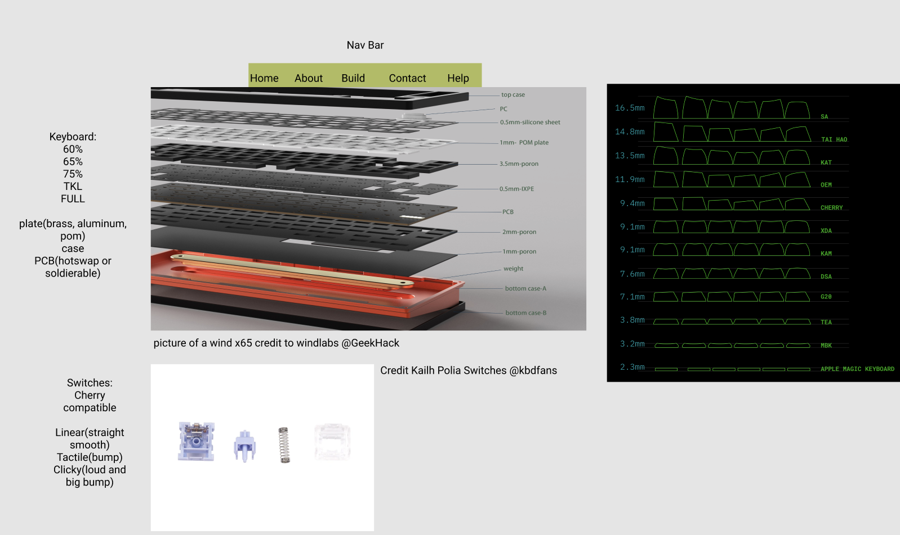
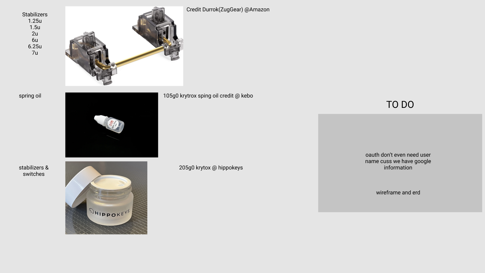
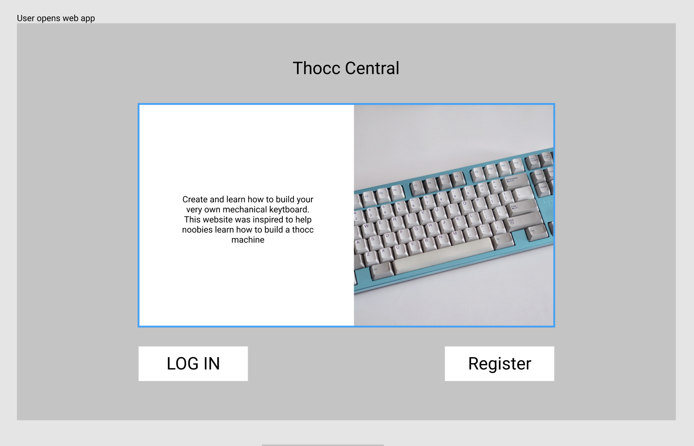
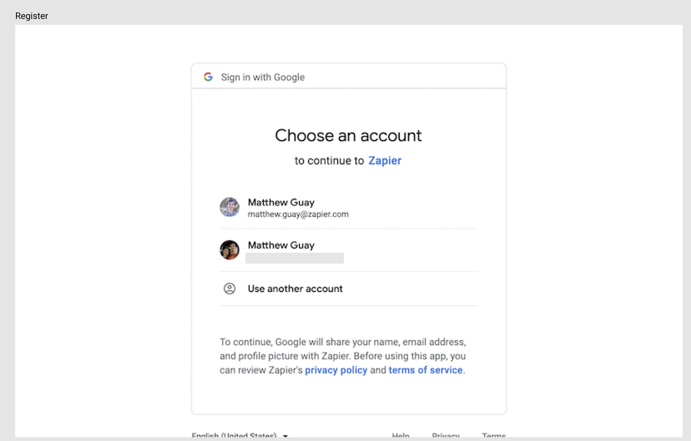
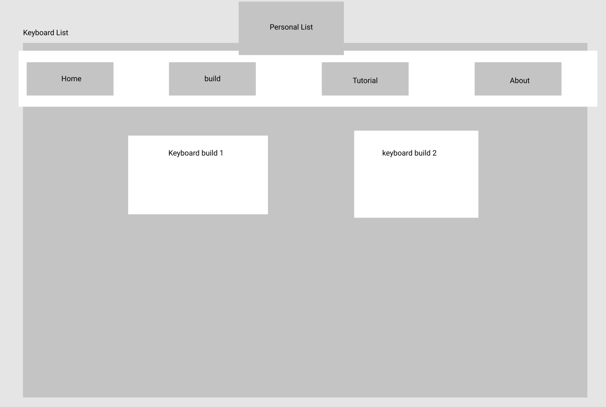
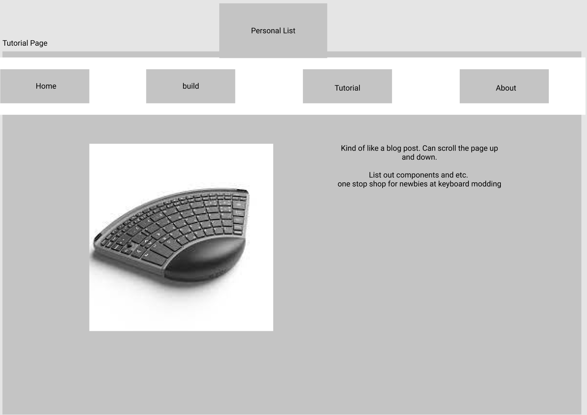
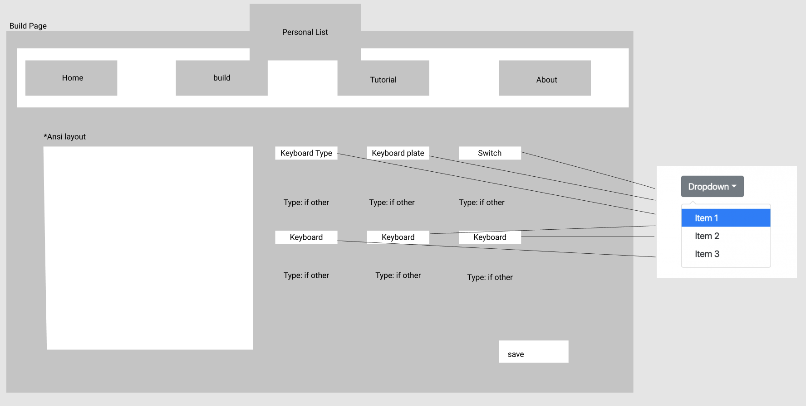
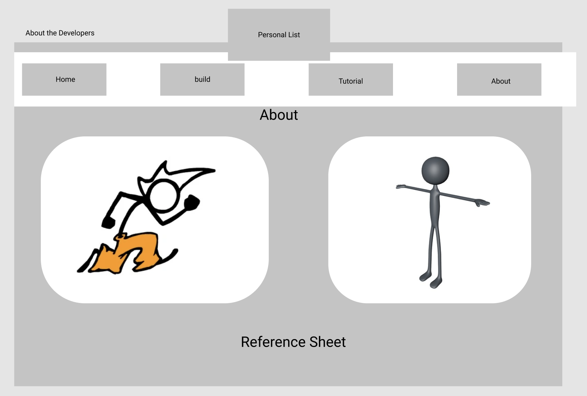

# project-2
Mech Keyboard Builder
In this section of the repo we go over the thought process and story creation of our fun keyboard web application. 
Inspired as a simple conversation of hobbies sparked an idea to help new hobbyists. 
With this application we have created a simple tutorial website for those wishing for more click in their clack.

## Concept: 
Similar to a fancy pen used to write. The new digital age requires us to constantly smash on our keyboards for what seems like hours.
So if we have to use a keyboard for so long everyday why don't we try to get the best feel and experience we want?
It is because many people do not know how to create their own keyboard or even where to start.
This website serves as a one stop site for people to save and create their own potential keyboard. Each user would be able to create 
as many keyboards as they want and alter the keyboards that they create. Another page will help provide an first look on what 
aspects of the keyboard they would need to be aware of. Simply put, the web application will help new hobbyists for keyboards to 
learn how to create a new keyboard and to save and update existing keyboards that they have created.

## Brainstorm
The initial idea of this brainstorm came out from a conversation among devs. The most difficult part of a creative assignment is being creative. 
When we were thinking about what kind of app we wanted to create we decidied to make something related to the things we think are fun. Eventually,
we came around to discussing keyboards. How keyboards can come in various forms and sounds. Creating the most pleasing experience for people
who have to be on their keyboards all day. Then we thought of creating a landing page for people who seek the same amazing experience you can create.
Together, we came up with this idea for a landing site with after hearing the sheer acoustics of a premium keyboard. 

Down below are some pictures of the brainstorming process.

This image shows the the first stages and different components of the read me page we needed to create. 

We see here the other components we needed to build a keyboard

This brain storm was later created into a build page for the website.

## Wireframes:
Landing Page

Oauth/User Verification Page

Build List Example

Blog or Tutorial Page

Create Keyboard Page

Get to Know Developers Page

## User Story:
As a user I should be able to name my custom keyboard build.
As a user I should be able to create a mechanical keyboard from several drop menus.

As a user I want to be able to select a specific size of a keyboard:
60%
65%
75%
Ten Key Less
Full Ten Key

As a user I want to choose the type of plate:
Plate 
Brass
Aluminum
Pom

As a user I want to pick a style of switch:
Linear
Tactile
Clicky

As a user I should be able to select a stabilizer kit:
Standard Stabilizer Kit

As a user I should be able to select a lubricant type:
Switch Oil A 
Switch Oil B

As a user I should be able to see a visual representation of each item that I select.
As a user I should be able to save my customized keyboard.
As a user I should be able to edit or delete my keyboard. 
As a user I should be able to create a new keyboard and save it to the page. 

## User Flow Chart

public/images/erd.png
## ERD (Entity Relationship Diagram)     

## Technologies 

## future additions